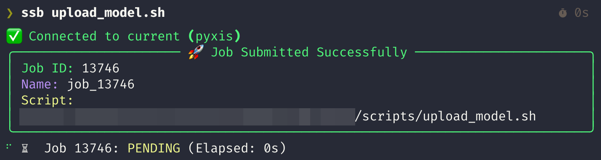
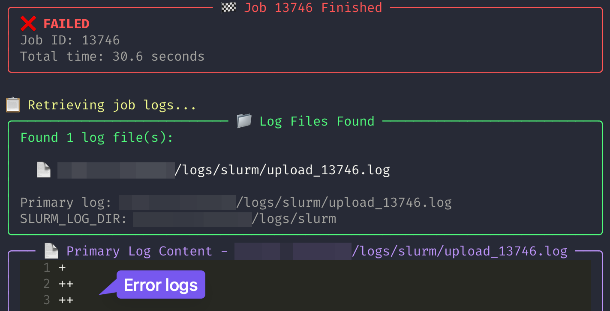

# SSH SLURM Client

A modern Python library and CLI tool for submitting and monitoring SLURM jobs on remote servers via SSH with a beautiful, user-friendly interface.

## ✨ Features

### 🚀 Job Management
- SLURM job submission via SSH connections
- Real-time job monitoring with beautiful Rich UI
- Automatic job log retrieval and display on failure
- Intelligent log file detection across multiple directories

### 📁 File Handling
- **Local files**: Automatically uploaded to server's temporary folder and executed
- **Remote files**: Direct execution of existing files on server
- Automatic cleanup of temporary files (configurable)

### 🔧 Connection Management
- SSH config (`~/.ssh/config`) support with host aliases
- Custom profile management for different environments
- ProxyJump support for complex network setups
- Automatic connection optimization

### 🌍 Environment Variables
- **Auto-detection**: Common variables (HF_TOKEN, WANDB_API_KEY, SLURM_LOG_DIR, etc.)
- **Profile-specific**: Set environment variables per profile
- **Manual override**: Command-line environment variable specification
- **Intelligent merging**: Profile → Local → Manual priority

### 🎨 User Experience
- Beautiful Rich-based UI with progress indicators and status icons
- Syntax-highlighted log output with error detection
- Intuitive command structure with comprehensive help
- Available as both CLI tool and Python library

## 📦 Installation

### Using uv (Recommended)
```bash
uv add ssh-slurm
```

### Using pip
```bash
pip install ssh-slurm
```

## 🚀 Quick Start

### Basic Job Submission

```bash
# Using SSH config host (via default config)
ssb my_training_script.sh

# Using a saved profile
ssb my_training_script.sh --profile production

# Direct connection
ssb my_script.sh --hostname dgx.example.com --username user --key-file ~/.ssh/id_rsa
```

### 📋 What You'll See

<div align="center">
  
</div>

If a job fails, you'll automatically see detailed logs:

<div align="center">
  
</div>

#### Detailed Options

```bash
# Verbose logging, job name specification, monitoring interval
ssb script.sh --host dgx1 --job-name my_job --poll-interval 5 --verbose

# Don't delete uploaded files
ssb script.sh --host dgx1 --no-cleanup

# Submit job without monitoring
ssb script.sh --host dgx1 --no-monitor

# Environment variables are automatically detected and transferred (HF_TOKEN, WANDB_API_KEY, etc.)
ssb script.sh --host dgx1

# Additionally pass local environment variables
ssb script.sh --host dgx1 --env-local CUSTOM_TOKEN

# Set custom environment variables
ssb script.sh --host dgx1 --env "CUSTOM_VAR=value" --env "DEBUG=true"

# Combined usage
ssb script.sh --host dgx1 --env-local CUSTOM_TOKEN --env "MODEL_NAME=llama3" --verbose
```

## 🔧 Profile Management

Profiles allow you to save connection settings and environment variables for different environments.

### Creating Profiles

**Using SSH config host:**
```bash
# Reference existing SSH config
ssb profile add production --ssh-host dgx-cluster --description "Production cluster"
```

**Direct connection:**
```bash
ssb profile add dev --hostname dev-dgx.local --username researcher --key-file ~/.ssh/dev_key --description "Development server"
```

### Managing Profiles

```bash
# List all profiles
ssb profile list

# Set current default profile
ssb profile set production

# Show profile details
ssb profile show production

# Update profile settings
ssb profile update production --description "Updated production cluster"

# Remove profile
ssb profile remove old-profile
```

### 🌍 Environment Variables per Profile

Each profile can have its own set of environment variables:

```bash
# Set environment variables for a profile
ssb profile env production set SLURM_LOG_DIR /shared/logs/slurm
ssb profile env production set HF_TOKEN hf_your_token_here
ssb profile env production set WANDB_PROJECT production-training

# List environment variables
ssb profile env production list

# Remove environment variable
ssb profile env production unset DEBUG_MODE
```

**Environment Variable Priority:**
1. 🔧 **Profile variables** (applied first)
2. 🏠 **Local environment** (auto-detected, can override profile)
3. ⚡ **Command-line** (highest priority with `--env`)

```bash
# This will use profile env vars + any local env vars + manual overrides
ssb train.sh --profile production --env "BATCH_SIZE=64"
```

### Using SSH Config

You can utilize settings described in `~/.ssh/config`:

```
Host dgx1
    HostName dgx1.example.com
    User username
    Port 22
    IdentityFile ~/.ssh/id_rsa

Host dgx-a100
    HostName 192.168.1.100
    User gpu_user
    Port 2222
    IdentityFile ~/.ssh/dgx_key
```

Usage examples:
```bash
ssb my_script.sh --host dgx1
ssb my_script.sh --host dgx-a100
```

## 🐍 Python API

### Basic Usage

```python
from ssh_slurm import SSHSlurmClient
from ssh_slurm.config import ConfigManager
from ssh_slurm.ssh_config import get_ssh_config_host

# Using SSH config
ssh_host = get_ssh_config_host("dgx-cluster")

# Create client with environment variables
env_vars = {
    "HF_TOKEN": "your_token",
    "WANDB_PROJECT": "experiment-1"
}

with SSHSlurmClient(
    hostname=ssh_host.effective_hostname,
    username=ssh_host.effective_user,
    key_filename=ssh_host.effective_identity_file,
    port=ssh_host.effective_port,
    env_vars=env_vars,
    verbose=True
) as client:
    
    # Submit job
    job = client.submit_sbatch_file(
        "./training_script.sh", 
        job_name="llm_training"
    )
    
    if job:
        print(f"Job submitted: {job.job_id}")
        
        # Monitor with custom polling
        final_job = client.monitor_job(job, poll_interval=30)
        
        # Get detailed logs on failure
        if final_job.status == "FAILED":
            log_info = client.get_job_output_detailed(job.job_id, job.name)
            print(f"Found logs: {log_info['found_files']}")
            print(f"Error output: {log_info['error']}")
        
        # Cleanup temporary files
        client.cleanup_job_files(job)
```

### Using Profiles

```python
from ssh_slurm.config import ConfigManager

# Load profile with environment variables
config_manager = ConfigManager()
profile = config_manager.get_profile("production")

# Profile automatically includes env_vars
with SSHSlurmClient(
    hostname=profile.hostname,
    username=profile.username,
    key_filename=profile.key_filename,
    env_vars=profile.env_vars,  # Includes SLURM_LOG_DIR, tokens, etc.
    verbose=False
) as client:
    job = client.submit_sbatch_file("./model_training.py")
    # Environment variables from profile are automatically applied
```

## File Handling

### Local Files
- Specified with relative or absolute path (not starting with `/`)
- Automatically uploaded to server's `/tmp/ssh-slurm/`
- Executable permissions automatically granted (.sh, .py, .pl, .r files)
- Automatically deleted after job completion (can be disabled with `--no-cleanup`)

### Remote Files
- Specified with absolute path (starting with `/`)
- Direct execution of existing files on server
- File existence verification performed

## ⚙️ Configuration Files

### Profile Settings (`~/.config/ssh-slurm.json`)

```json
{
  "current_profile": "production",
  "profiles": {
    "production": {
      "hostname": "dgx-cluster.company.com",
      "username": "ml_researcher",
      "key_filename": "/home/user/.ssh/production_key",
      "port": 22,
      "description": "Production ML cluster",
      "ssh_host": null,
      "env_vars": {
        "SLURM_LOG_DIR": "/shared/logs/slurm",
        "WANDB_PROJECT": "production-experiments",
        "HF_TOKEN": "hf_your_token_here"
      }
    },
    "development": {
      "hostname": null,
      "username": null,
      "key_filename": null,
      "port": 22,
      "description": "Development cluster via SSH config",
      "ssh_host": "dev-dgx",
      "env_vars": {
        "DEBUG": "true",
        "BATCH_SIZE": "16",
        "SLURM_LOG_DIR": "/tmp/slurm_logs"
      }
    }
  }
}
```

### SSH Config (~/.ssh/config)

Supports standard SSH configuration files:

```
Host pattern
    HostName hostname
    User username
    Port port
    IdentityFile ~/.ssh/key_file
    ProxyJump jump_host
    # Other SSH settings
```

## Security

- **Passwords are not stored in configuration files**
- Only SSH private key file authentication is supported
- Uploaded files are temporarily stored on server and deleted after completion

## 📚 Command Reference

### `ssb` - Job Submission

```bash
ssb <script_path> [options]
```

**Connection Options:**
- `--host, -H <host>` - SSH host from .ssh/config
- `--profile, -p <profile>` - Use saved profile
- `--hostname <hostname>` - Server hostname (direct connection)
- `--username <username>` - SSH username (direct connection)
- `--key-file <path>` - SSH private key file path (direct connection)
- `--port <port>` - SSH port (default: 22)

**Job Options:**
- `--job-name <name>` - Custom job name
- `--poll-interval <seconds>` - Status polling interval (default: 10)
- `--timeout <seconds>` - Monitoring timeout
- `--no-monitor` - Submit without monitoring
- `--no-cleanup` - Don't delete uploaded files

**Environment Options:**
- `--env KEY=VALUE` - Set environment variable (repeatable)
- `--env-local KEY` - Pass local environment variable (repeatable)

**Other Options:**
- `--verbose, -v` - Enable detailed logging
- `--help, -h` - Show help

### `ssb profile` - Profile Management

```bash
ssb profile <command> [options]
```

**Commands:**
- `add <name>` - Create new profile
- `list` - List all profiles
- `show [name]` - Show profile details (current if no name)
- `set <name>` - Set default profile
- `update <name>` - Update profile settings
- `remove <name>` - Delete profile
- `env <name> <subcommand>` - Manage environment variables

**Environment Variable Commands:**
```bash
ssb profile env <profile_name> set <key> <value>    # Set variable
ssb profile env <profile_name> unset <key>          # Remove variable
ssb profile env <profile_name> list                 # List all variables
```

### Auto-detected Environment Variables

The following environment variables are automatically detected and transferred:
- `HF_TOKEN`, `HUGGING_FACE_HUB_TOKEN` - Hugging Face authentication
- `WANDB_API_KEY`, `WANDB_ENTITY`, `WANDB_PROJECT` - Weights & Biases
- `OPENAI_API_KEY`, `ANTHROPIC_API_KEY` - AI service APIs
- `SLURM_LOG_DIR` - Custom SLURM log directory
- `CUDA_VISIBLE_DEVICES` - GPU visibility
- `HF_HOME`, `HF_HUB_CACHE`, `TRANSFORMERS_CACHE`, `TORCH_HOME` - Cache directories

## 💡 Advanced Examples

### Machine Learning Workflow
```bash
# Set up environment for production training
ssb profile env production set SLURM_LOG_DIR /shared/logs/ml
ssb profile env production set WANDB_PROJECT llm-training
ssb profile env production set HF_TOKEN your_hf_token

# Submit training job with monitoring
ssb train_llama.sh --profile production --job-name llama-finetune-v2
```

### Multi-environment Setup
```bash
# Development environment
ssb profile add dev --ssh-host dev-cluster --description "Development cluster"
ssb profile env dev set DEBUG "true"
ssb profile env dev set BATCH_SIZE "32"

# Production environment  
ssb profile add prod --ssh-host prod-cluster --description "Production cluster"
ssb profile env prod set BATCH_SIZE "128"
ssb profile env prod set WANDB_PROJECT "production"

# Switch between environments easily
ssb experiment.sh --profile dev    # Use dev settings
ssb experiment.sh --profile prod   # Use production settings
```

### Custom Environment Overrides
```bash
# Use profile settings but override specific variables
ssb train.sh --profile production \
  --env "LEARNING_RATE=1e-4" \
  --env "MODEL_SIZE=7B" \
  --job-name custom-experiment
```

### Remote Script Execution
```bash
# Execute script already on server
ssb /shared/scripts/distributed_training.sh --host cluster-head

# Execute local script with custom settings
ssb ./local_experiment.py --host dgx1 --no-cleanup --verbose
```

## 🏗️ Development

### Requirements
- Python 3.12+
- Rich 13.0.0+ (for beautiful CLI interface)
- Paramiko 4.0.0+ (for SSH connections)

### Building from Source
```bash
git clone https://github.com/your-repo/ssh-slurm.git
cd ssh-slurm
uv pip install -e .
```

## 🤝 Contributing

Contributions are welcome! Please feel free to submit a Pull Request.

## 📄 License

MIT License - see LICENSE file for details.